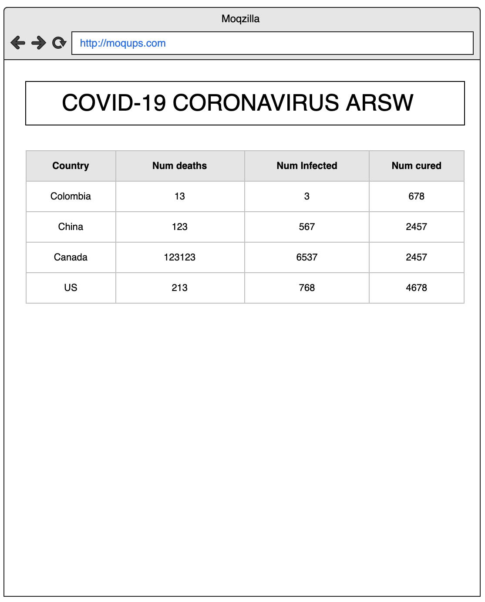
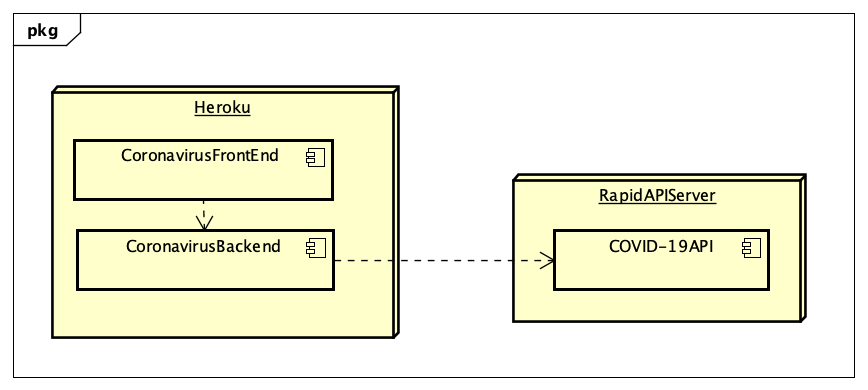

{\rtf1\ansi\ansicpg1252\cocoartf2511
\cocoatextscaling0\cocoaplatform0{\fonttbl\f0\fmodern\fcharset0 Courier;}
{\colortbl;\red255\green255\blue255;\red0\green0\blue0;}
{\*\expandedcolortbl;;\cssrgb\c0\c0\c0;}
\margl1440\margr1440\vieww10800\viewh8400\viewkind0
\deftab720
\pard\pardeftab720\sl280\partightenfactor0

\f0\fs24 \cf2 \expnd0\expndtw0\kerning0
\outl0\strokewidth0 \strokec2 # Escuela Colombiana de Ingenier\'eda Julio Garavito - Arquitecturas de Software ARSW - Parcial Segundo Tercio\
\
## Preparaci\'f3n para el Parcial\
\
Con el objetivo de preparar el examen final del segundo tercio, por favor siga las siguientes instrucciones.\
\
1. Explore el API de COVID-19 Coronavirus Statistics en el siguiente [enlace](https://rapidapi.com/KishCom/api/covid-19-coronavirus-statistics)\
2. Use la colecci\'f3n de Postman adjunta para validar el funcionamiento del endpoint por fuera de la p\'e1gina de RappidAPI.\
3. Si no ha terminado por completo el \'faltimo laboratorio, hagalo, si es necesario desde el inicio y completo. En ese laboratorio esta basado el parcial.\
4. Revise la documentaci\'f3n de Google Maps para agregar marcadores a un mapa o revise este [Codepen](https://codepen.io/SitePoint/pen/YWKLzv?editors=0110)\
\
## Descripci\'f3n del Problema a Solucionar\
\
Usted est\'e1 muy preocupado por la situaci\'f3n sanitaria que atraviesa el mundo debido al virus COVID-19 popularmente llamado Coronavirus. Es por eso que usted decidi\'f3 hacer una aplicaci\'f3n web informativa donde se pueda leer f\'e1cilmente informaci\'f3n est\'e1distica al respecto.\
\
La aplicaci\'f3n mostrar\'e1 inicialmente una est\'e1distica general en la cu\'e1l se pueden listar todos los paises que present\'e1n casos de infecci\'f3n confirmados, muertes y finalmente personas curadas. Esta lista deber\'e1 aparecer ordenada por los siguientes criterios:\
\
 - N\'famero de muertes.\
 - N\'famero de infectados.\
 - N\'famero de curados.\
\
Adicionalmente cuando el usuario de la aplicaci\'f3n haga click sobre el nombre de un pa\'eds determinado, usted debe mostrar la misma informaci\'f3n (casos de infecci\'f3n confirmados, muertes y personas curadas) solo que en esta ocasi\'f3n debe hacerlo no de manera consolidada sino que debe expandir la informaci\'f3n por provincia. (Pruebe con China, Canada o US, pa\'edses con m\'faltiples provisncias infectadas).\
\
Para obtener dicha informaci\'f3n utilice el API gratuito de [COVID-19 Coronavirus Statistics](https://rapidapi.com/KishCom/api/covid-19-coronavirus-statistics) el cual usted debi\'f3 estudiar previamente antes de este examen.\
\
Se le pide que su implementaci\'f3n sea eficiente en cuanto a recursos as\'ed que debe implementar un cach\'e9 que permita evitar hacer consultas repetidas al API externo cuando consulte las estadisticas para un pa\'eds especifico.\
\
\
\
Una vez tenga la funcionalidad b\'e1sica, extienda su implementaci\'f3n para incluir un mapa en el cual resalte con un indicador la ubicaci\'f3n del pa\'eds seleccionado por el usuario (revise la funcionalidad del API de mapas y el ejemplo anexo.).\
\
Como el API del coronavirus no brinda informaci\'f3n sobre la latitud y longitud del pa\'eds consultado, apoyese en este [API](https://rapidapi.com/apilayernet/api/rest-countries-v1?endpoint=53aa5a09e4b051a76d24136a). AJUSTE LOS DIAGRAMAS DE ARQUITECTURA QUE SEAN NECESARIOS PARA REFLEJAR EL USO DE ESTE COMPONENTE.\
\
\
\
Sugerencia realice la implementaci\'f3n de manera incremental. Haga commits regulares.\
\
## Requerimientos de Arquitectura\
\
 1. El cliente Web debe ser un cliente as\'edncrono que use servicios REST desplegados en Heroku y use JSON como formato para los mensajes.\
 2. El servidor de Heroku servir\'e1 como un gateway para encapsular llamadas a otros servicios Web externos.\
 3. La aplicaci\'f3n debe ser multiusuario (Sin registro y sin seguridad)\
 4. Todos los protocolos de comunicaci\'f3n ser\'e1n sobre HTTP.\
 5. La interfaz gr\'e1fica del cliente debe ser los m\'e1s limpia y agradable posible y debe utilizar Bootstrap. Para invocar m\'e9todos REST desde el cliente usted puede utilizar la tecnolog\'eda que desee.\
 6. La fachada de servicios tendr\'e1 un cach\'e9 que permitir\'e1 que llamados que ya se han realizado a las implementaciones concretas con par\'e1metros espec\'edficos no se realicen nuevamente. Puede almacenar el llamado como un String con su respectiva respuesta, y comparar el string respectivo. Recuerde que el cach\'e9 es una estructura de datos. (Hashmap por ejemplo)\
 7. Se debe poder extender f\'e1cilmente, por ejemplo, es f\'e1cil agregar nuevas funcionalidades, o es f\'e1cil cambiar el proveedor de una funcionalidad.\
 8. Debe utilizar maven para gestionar el ciclo de vida, git y GitHub para almacenar al c\'f3digo fuente y Heroku como plataforma de producci\'f3n.\
\
### Diagrama de Despliegue\
\
\
\
### Diagrama de Componentes\
\
\
\
## Requerimientos de Entrega\
\
1.  La aplicaci\'f3n funcionando en Heroku con el nombre (NOMBRE-APELLIDO-ARSW-T2) y el c\'f3digo fuente almacenado en un proyecto GitHub con el nombre (NOMBRE-APELLIDO-ARSW-T2).\
2.  Los fuentes deben estar documentados y bien estructurados para generar el Javadoc.\
3.  El README.md debe describir:\
	1. El dise\'f1o de arquitectura. \
	2. La forma de ejecutar el programa localmente. \
	3. Explicar c\'f3mo se puede extender y c\'f3mo podr\'eda, por ejemplo, hacer que una funci\'f3n espec\'edfica la implementara un proveedor de servicios diferente.\
	4. Indique la urls de Heroku\
    5. Indique si hizo los bonos y una evidencia de su ejecuci\'f3n.\
4.  Suba el zip del proyecto al aula con el nombre (NOMBRE-APELLIDO-ARSW-T2).\
5.  Guarde una copia de su proyecto.\
\
> IMPORTANTE! El parcial que no sea subido a tiempo o que no cumpla al pie de la letra con las condiciones de entrega, ser\'e1 calificado con 0.0 sin lugar a reclamaciones, ya que las condiciones est\'e1n claras.\
\
## Criterios de Evaluaci\'f3n\
\
1.  Cliente escrito en JS as\'edncrono invocando servicios REST (10%)\
2.  Servidor fachada exponiendo servicios REST (10%)\
3.  Conexi\'f3n a servicios externos (10%)\
4.  Cliente Java para Tests concurrentes para el servicio en Heroku y para el del proveedor externo(10%)\
5.  Cache tolerante a la concurrencia y una sola instancia para la aplicaci\'f3n (10%)\
6.  Implementa la funcionalidad de los mapas de manera as\'edncrona (15%)\
7.  Dise\'f1o y descripci\'f3n del dise\'f1o son de alta calidad (30%)\
    -   Extensible\
    -   Usa patrones\
    -   Modular\
    -   Organizado\
    -   Javadoc publicado\
    -   Identifica la funci\'f3n de componentes individuales demuestra conocimiento del funcionamiento general de la arquitectura.\
\
## Bonos\
\
1. Si el dato del cache tiene m\'e1s de 5 min se debe solicitar nuevamente al servidor externo.\
2. Poner un marcador NO solo sobre el pa\'eds seleccionado, sino sobre todas las provincias infectadas de ese pa\'eds.\
\
## Ayuda\
\
 - Inicie con la aplicaci\'f3n web basada en spring que le propone Heroku en su gu\'eda inicial para java. ([https://devcenter.heroku.com/articles/getting-started-with-java](https://devcenter.heroku.com/articles/getting-started-with-java))\
  - Como poner marcadores en un mapa de Google Maps\
 [Codepen example](https://codepen.io/SitePoint/pen/YWKLzv?editors=0110)\
 - Para invocar un servicios get desde java puede hacerlo de manera f\'e1cil como muestra el siguiente c\'f3digo, revise la [clase de pruebas adjunto al examen](coronavirusAPITest/src/test/java/coronavirusAPITest/UnirestTest.java) para m\'e1s informaci\'f3n:\
```java\
    @Test\
	public void shouldReturnAllCases() throws UnirestException \{\
		HttpResponse<JsonNode> response = Unirest\
				.get("https://covid-19-coronavirus-statistics.p.rapidapi.com/v1/stats")\
				.header("x-rapidapi-host", "covid-19-coronavirus-statistics.p.rapidapi.com")\
				.header("x-rapidapi-key", "34f05cff54msh30ba6f36c91c183p166499jsn555917ef62b8")\
				.asJson();\
		\
		assertNotNull(response.getBody());\
		assertEquals((int)HttpStatus.SC_OK,response.getStatus());\
	\}\
```\
 - Parseo de Json\
```html\
<!DOCTYPE html>\
<html>\
<body>\
\
<h2>Create Object from JSON String</h2>\
\
<p id="demo"></p>\
\
<script>\
var txt = '\{"name":"John", "age":30, "city":"New York"\}'\
var obj = JSON.parse(txt);\
document.getElementById("demo").innerHTML = "name: " + obj.name + ", age: " + obj.age;\
</script>\
\
</body>\
</html>\
```\
}
